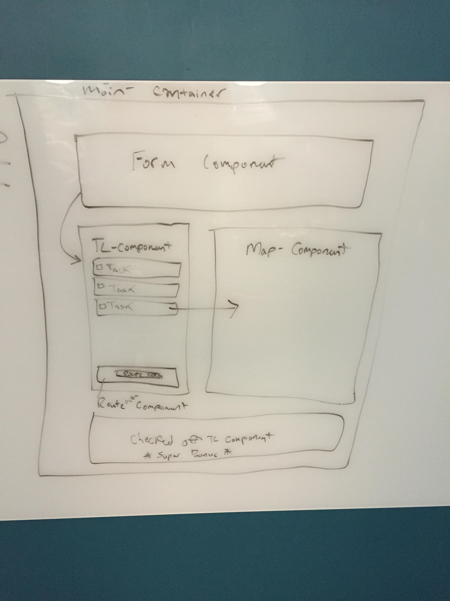
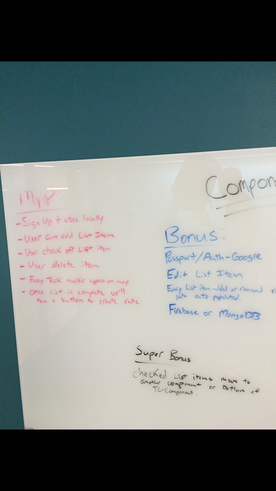

# React Project

## The App
This app allows users to create a to-do list or task list and view the route to get those tasks done. When a user adds a task to their task list, a marker is added to the map. The map then provides the best route based on the markers on the map. When a user removes a task from the list, the marker is removed from the map. 

## Technologies Used
Node.js, Express.js, Google Maps API, React, Firebase, Webpack, CSS, Bootstrap, jQuery, Google Map React, Underscore.js

We used Express and Node to run our app. React was used to create our Single Page Application. React allowed us to make updates to our list and map, without refreshing the page.

Firebase, a realtime database, was used to store/update/delete our data. Changes are made in realtime on both the client side and server side. Firebase is easy to implement in web and mobile applications. 

Bootstrap and CSS were used for styling our application. 

## Approach Taken
Before we began coding, our group collaborated on the following: 
1. Brainstorming and choosing a project idea,
2. User Stories,
3. ERDs,
4. Components
5. Wireframes,
6. Potential Bonus Features,
7. A Plan of Action and Goals/Deadlines

Next, we took a "divide and conquer" approach with the following steps:
1. Creating a local repository, pushing to GitHub and adding collaborators 
2. Creating MVP
3. Styling
4. Deploying

We worked as a group, pair programmed and worked individually throughout the project week.

## User Stories
* User comes to site
* User adds items to the list (item must have name, street name)
* For each item  added a pin/marker is dropped on map
* User can check items completed
* Routes user from point A to point B

## Installation Instructions
1. Fork and/or clone the repository to your local machine
2. Run `npm install` inside the directory to install all the dependecies used in this project.
3. Once the dependecies are installed, you can run `nodemon` in terminal and visit localhost:3000 to view the web app locally.
4. The website can be viewed online at http://task-lister.herokuapp.com/ as well.

## Unsolved Problems
We had several bonus features we were unable to resolve or ran into a time crunch on.
* OAuth/Passport Auth
* Editing tasks
* Checked items move to a bottom of list or another component
* Multiple lists

